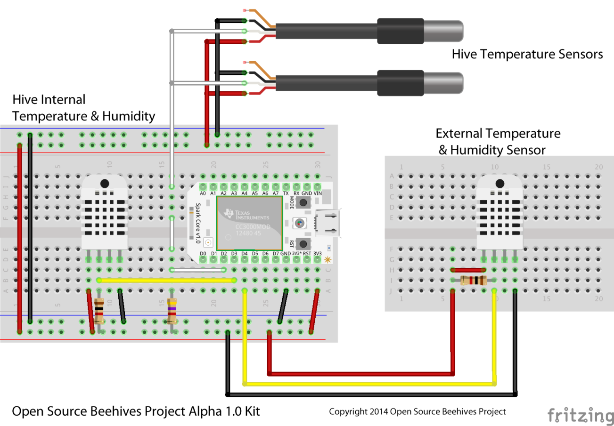

#Open Source Beehives Project #
#Alpha Sensor Kit 0.2 #
====================================================

Developed for Open Source Beehives Project
http://opensourcebeehives.net

Some files are Copyright 2014 Scott Piette (scott.piette@gmail.com)
Main example is Copyright 2014 Open Source Beehives Project (www.opensourcebeehives.net)

**Spark Core Alpha 0.2 Version**
The Alpha sensor kit uses 2x DHT22 Temperature and Humidity sensors and 2x DS18B20 Temperature Sensors. The application is built upon a unified sensor framework that allows for adding different sensors in the future.

**List of equipment in the Alpha Version**

* (1) DHT22 sensor is used for monitoring outdoor Temperature and Humidity
* (1) DHT22 sensor is used for monitoring hive Temperature and Humidity
* (2) DS18B20 sensors are for monitoring Temperatures in other locations inside the beehive.

Data is collected every ten minutes and reported to a internet server running the SparkFun Phant database.

**Installation**
------------
The application can be found under the Spark Web IDE as "OSBH"

```
Login to your Spark accuont at www.spark.io/build
Select "Libraries"
Select "OSBH"
  NOTE: app-osbh.ino will be the first in the list
Select "USE THIS EXAMPLE"
Select "Save"
Select "Verify"
Select "Flash"
```

**Hardware**
--------
The following diagram shows you how to connect your sensors to the core


**License**
--------
This application contains several libraries, so some of the libraries have their own license.  Check the header of the .cpp and .h files for the specific details.

The main application is released under the [GNU General Public License v3.0](./LICENSE)

