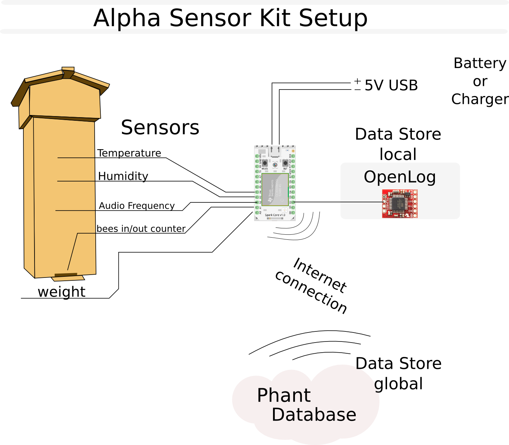

#Open Source Beehives Project #
#Alpha Sensor Kit 0.4 #
====================================================

Developed for Open Source Beehives Project
http://opensourcebeehives.net

Some files are Copyright 2014 Scott Piette (scott.piette@gmail.com)  
Main example is Copyright 2014 Open Source Beehives Project (www.opensourcebeehives.net)

**Spark Core Alpha 0.4 Version**

The Alpha sensor kit is able to measure:

* Temperature
* Humidity
* Weight
* Audio frequency

It uses 2x DHT22 Temperature and Humidity sensors and 2x DS18B20 Temperature Sensors. 

The application is built upon a unified sensor framework that allows for adding different sensors in the future.
NOTE: v0.4 implements the weight and audio sensors without the unified sensor framework -> will be done in the future.

**List of equipment in the Alpha Version**

* (1) DHT22 sensor is used for monitoring outdoor Temperature and Humidity
* (1) DHT22 sensor is used for monitoring hive Temperature and Humidity
* (2) DS18B20 sensors are for monitoring Temperatures in other locations inside the beehive.
* (1) H30A Load Cell is used for measuring weight of the hive
* (1) Microphone is used to record bees inside the hive 
* (1) microSD CARD to store data

Data is collected every ten minutes and reported to a internet server running the SparkFun Phant database.
In Parallel Data can be saved offline to the SD Card.

**Installation**
------------
install spark-client software and compile the files included in spark.include via

spark compile firmware OSBH.bin

flash the spark via internet or usb connection

sudo spark flash --usb OSBH.bin

**Hardware**
--------

***solder the alpha PCB board***

find the eagle schematics under hardware

**License**
--------
This application contains several libraries and files.  Check the comments section of the .cpp and .h files for the specific details on the licenses.
