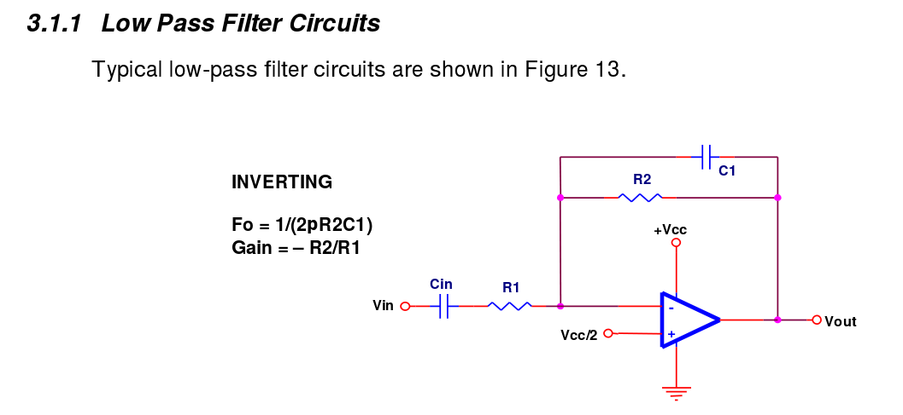
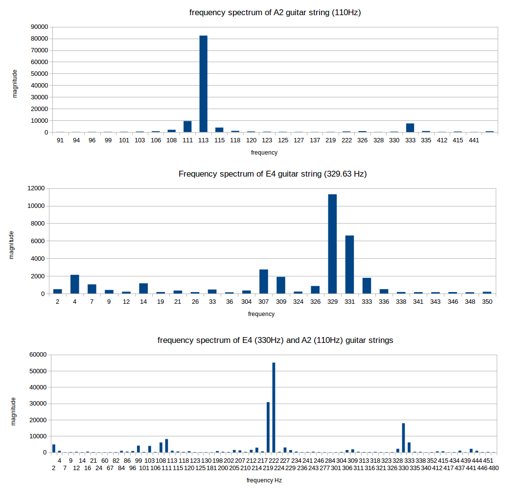

#Open Source Beehives Project #
#Audio Sensor 0.1 #
====================================================

Developed by Open Source Beehives Project
http://opensourcebeehives.net

Copyright 2014 Open Source Beehives Project (www.opensourcebeehives.net)

** Audio Sensor Version 0.1 **
--------
This Sensor is taking audio samples at a defined sampling rate and performing a Fast-Fourier-Transformation.

The hardware is basicly an amplifying circuit with low pass filter features connected to analog pin 1 of the spark core.
Example found on https://courses.cit.cornell.edu/bionb440/datasheets/SingleSupply.pdf

The used circuit is an adaption of the sparkfun board breakout: https://courses.cit.cornell.edu/bionb440/datasheets/SingleSupply.pdf and uses an 
100pF capacitor instead of 12pf and a 22uF input decoupling capacitor instead of an 1uF.

The Code is based on the kissFFT library by benswift. Read the code comments for more information.

**Test output of the FFT Code**

**License**
--------

